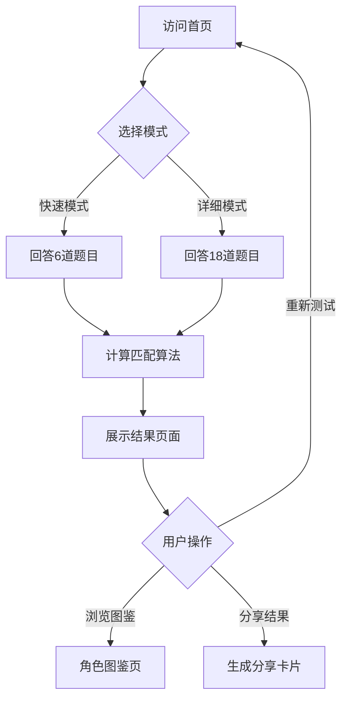

# 崩坏：星穹铁道角色匹配测试 - 产品需求文档

## 1. 产品概述

一款基于《崩坏：星穹铁道》角色性格分析的静态匹配测试网站。用户通过回答精心设计的性格测试题目，系统基于科学的多维性格分析算法匹配最相似的游戏角色，无需登录即可使用。

目标用户：崩坏星穹铁道玩家、二次元爱好者、对性格测试感兴趣的用户。

## 2. 核心功能

### 2.1 用户角色
| 角色 | 注册方式 | 核心权限 |
|------|----------|----------|
| 访客 | 无需注册 | 选择测试模式、答题、查看结果、分享结果 |

### 2.2 功能模块
1. **首页**：视觉震撼的入口页面，展示网站主题，提供模式选择
2. **测试页**：题目展示与答题交互，进度追踪
3. **结果页**：匹配角色展示、性格分析、相似角色推荐
4. **角色图鉴页**：所有角色浏览与搜索

### 2.3 页面详情
| 页面名称 | 模块名称 | 功能描述 |
|----------|----------|----------|
| 首页 | Hero区域 | 星空主题动态背景，标题动画，模式选择卡片 |
| 首页 | 模式选择 | 快速模式(6题)与详细模式(18题)选择入口 |
| 首页 | 角色预览 | 横向滚动展示部分热门角色头像 |
| 测试页 | 进度条 | 显示当前答题进度 |
| 测试页 | 题目卡片 | 展示题目与选项，支持点击/键盘选择 |
| 测试页 | 过渡动画 | 题目切换时的星穹主题过渡效果 |
| 结果页 | 角色展示 | 匹配角色的立绘、头像、基本信息展示 |
| 结果页 | 匹配度分析 | 雷达图展示多维度性格匹配度 |
| 结果页 | 角色介绍 | 角色背景故事、性格特征、经典台词 |
| 结果页 | 相似推荐 | 展示第二、第三匹配角色 |
| 结果页 | 分享功能 | 生成结果卡片，支持复制/保存图片 |
| 角色图鉴 | 筛选器 | 按命途、属性、阵营筛选角色 |
| 角色图鉴 | 角色网格 | 展示所有角色卡片，点击查看详情 |

## 3. 核心流程

用户访问首页 → 选择测试模式(快速/详细) → 逐题回答 → 系统计算匹配 → 展示结果页面 → 可选择重新测试/浏览图鉴/分享结果

## 4. 用户界面设计

### 4.1 设计风格
- **主题**：深邃星空 + 星穹铁道科幻美学
- **主色调**：深空蓝(#0a0e27)为底色，星辉金(#ffd700)为强调色，辅以紫罗兰(#8b5cf6)渐变
- **按钮样式**：圆角矩形，悬浮时有星光粒子扩散效果
- **字体**：标题使用"Noto Serif SC"衬线体营造史诗感，正文使用"Noto Sans SC"保证可读性
- **布局**：居中卡片式布局，大量留白，内容聚焦
- **图标风格**：线性图标，星穹主题装饰元素

### 4.2 页面设计概述
| 页面名称 | 模块名称 | UI元素 |
|----------|----------|--------|
| 首页 | Hero区域 | 全屏Canvas星空粒子背景，标题逐字浮现动画，底部渐变遮罩 |
| 首页 | 模式选择 | 两张悬浮卡片，悬停时上浮+发光边框，快速模式蓝色调/详细模式金色调 |
| 测试页 | 题目区域 | 中央大卡片，题目文字打字机效果，选项按钮依次淡入 |
| 测试页 | 进度指示 | 顶部细进度条，星形节点标记已答题 |
| 结果页 | 角色展示 | 角色立绘居中，匹配度环形进度条，信息卡片层叠布局 |
| 结果页 | 雷达图 | 六维性格雷达图，使用渐变色填充 |
| 角色图鉴 | 网格布局 | 响应式网格，角色卡片悬停放大+信息显示 |

### 4.3 响应式设计
- **桌面端**：最大宽度1200px居中，多列网格，完整动画效果
- **平板端**：768px断点，两列网格，简化部分动画
- **移动端**：375px断点，单列布局，触摸优化，底部固定导航

## 5. 角色数据来源

基于米游社wiki、哔哩哔哩wiki、萌娘百科等官方及社区资源，收集角色数据包括：
- 基础信息：姓名、命途、属性、阵营、稀有度
- 性格特征：基于MBTI、九型人格及游戏剧情表现
- 角色立绘与头像图片链接

## 6. 匹配算法设计

### 6.1 性格维度
采用六维性格分析模型：
1. **外向性(E) vs 内向性(I)**：社交倾向
2. **直觉性(N) vs 实感性(S)**：信息获取方式
3. **思考性(T) vs 情感性(F)**：决策方式
4. **判断性(J) vs 感知性(P)**：生活方式
5. **冒险性(A) vs 保守性(C)**：风险接受度
6. **独立性(D) vs 合作性(CO)**：团队协作倾向

### 6.2 算法逻辑
- 每题对应一个或多个维度的权重变化
- 用户选择后累加各维度得分
- 最终生成用户六维性格向量
- 与角色预设向量计算欧几里得距离
- 距离最近的角色为最佳匹配，次近为相似推荐

## 7. 动画与交互设计

### 7.1 入场动画
- 首页标题：逐字淡入+轻微上浮，间隔50ms
- 背景星空：Canvas粒子缓慢漂移，鼠标交互产生涟漪
- 模式卡片：从下方滑入，stagger延迟150ms

### 7.2 答题交互
- 题目切换：当前卡片向左滑出，新卡片从右滑入
- 选项选择：点击后按钮高亮，其他选项淡出，1秒后自动切换
- 进度条：平滑过渡动画，节点激活时闪烁星光

### 7.3 结果页动画
- 角色立绘：从中心放大淡入，持续800ms
- 匹配度环：从0%动画增长到实际值
- 雷达图：线条逐边绘制，区域渐显
- 信息卡片：依次从下方向上滑入

## 8. 内容准确性

- 所有角色信息基于游戏官方设定
- 性格分析参考游戏剧情、角色语音、官方资料
- 匹配逻辑透明，结果页展示各维度得分对比
