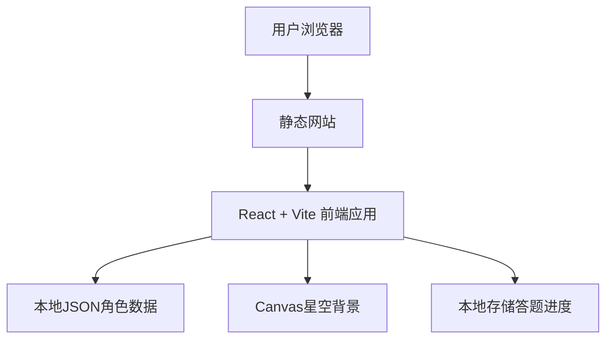

# 崩坏：星穹铁道角色匹配测试 - 技术架构文档

## 1. 架构设计



纯前端静态网站架构，无需后端服务，所有数据内置于项目中。

## 2. 技术选型

- **前端框架**：React 18 + TypeScript
- **构建工具**：Vite 5
- **样式方案**：Tailwind CSS 3
- **UI组件**：shadcn/ui
- **动画库**：Framer Motion
- **图表库**：Chart.js + react-chartjs-2（雷达图）
- **Canvas背景**：原生Canvas API
- **图标**：Lucide React
- **字体**：Google Fonts (Noto Serif SC, Noto Sans SC)

## 3. 路由定义

| 路由 | 用途 |
|------|------|
| / | 首页 - 模式选择 |
| /quiz/:mode | 测试页 - mode为quick或detailed |
| /result | 结果页 - 展示匹配角色 |
| /characters | 角色图鉴页 |
| /character/:id | 角色详情页 |

## 4. 数据模型

### 4.1 角色数据结构
```typescript
interface Character {
  id: string;
  name: string;
  title?: string;
  rarity: 4 | 5;
  path: string; // 命途
  element: string; // 属性
  faction: string; // 阵营
  description: string; // 角色介绍
  personality: string; // 性格描述
  quote: string; // 经典台词
  mbti?: string; // MBTI类型
  enneagram?: string; // 九型人格
  // 六维性格向量 (-10 到 10)
  traits: {
    extraversion: number; // 外向性
    intuition: number; // 直觉性
    thinking: number; // 思考性
    judging: number; // 判断性
    adventurous: number; // 冒险性
    independent: number; // 独立性
  };
  imageUrl: string; // 立绘链接
  avatarUrl: string; // 头像链接
}
```

### 4.2 题目数据结构
```typescript
interface Question {
  id: number;
  text: string;
  options: {
    text: string;
    // 各维度权重变化
    weights: {
      extraversion?: number;
      intuition?: number;
      thinking?: number;
      judging?: number;
      adventurous?: number;
      independent?: number;
    };
  }[];
}
```

### 4.3 用户答案数据结构
```typescript
interface UserAnswer {
  questionId: number;
  optionIndex: number;
  weights: Record<string, number>;
}
```

## 5. 核心算法

### 5.1 匹配算法
```typescript
function calculateMatch(userTraits: Traits, character: Character): number {
  const dims = ['extraversion', 'intuition', 'thinking', 
                'judging', 'adventurous', 'independent'];
  let sumSquaredDiff = 0;
  
  for (const dim of dims) {
    const diff = userTraits[dim] - character.traits[dim];
    sumSquaredDiff += diff * diff;
  }
  
  const distance = Math.sqrt(sumSquaredDiff);
  // 转换为匹配度百分比 (最大距离约 34.6)
  const maxDistance = Math.sqrt(6 * 20 * 20); // 6维 * (20)^2
  const matchPercent = Math.max(0, 100 - (distance / maxDistance * 100));
  
  return Math.round(matchPercent);
}
```

### 5.2 状态管理
使用 React Context + useReducer 管理全局状态：
- 当前测试模式
- 答题进度
- 用户性格向量
- 匹配结果

## 6. 组件架构

### 6.1 页面组件
- `HomePage` - 首页
- `QuizPage` - 测试页
- `ResultPage` - 结果页
- `CharactersPage` - 角色图鉴页
- `CharacterDetailPage` - 角色详情页

### 6.2 通用组件
- `StarfieldBackground` - Canvas星空背景
- `ModeCard` - 模式选择卡片
- `QuestionCard` - 题目卡片
- `ProgressBar` - 进度条
- `CharacterCard` - 角色卡片
- `RadarChart` - 性格雷达图
- `MatchRing` - 匹配度环形图
- `ShareCard` - 分享卡片生成

### 6.3 Hooks
- `useQuiz` - 测试逻辑管理
- `useCharacterMatch` - 角色匹配计算
- `useLocalStorage` - 本地存储

## 7. 性能优化

- 图片懒加载（角色图鉴）
- Canvas背景使用 requestAnimationFrame
- 组件懒加载（react.lazy）
- 动画使用 GPU 加速（transform, opacity）
- 字体预加载

## 8. 构建与部署

- 构建命令：`npm run build`
- 输出目录：`dist`
- 静态部署：可直接部署到任何静态托管服务
